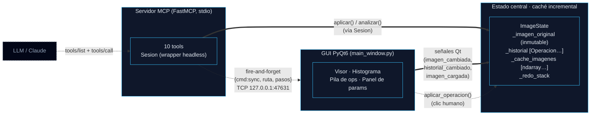

# DIGEST — PhotoLab Pro (para ficha de portafolio)

> Archivo de insumo para el agente del portafolio web (React).
> Contiene SOLO datos verificados del código fuente al **2026-07-04**.
> La arquitectura completa ya está en `DOC_TECNICO_PhotoLab_Pro.md` — **no se repite aquí**.

---

## 0. One-liner (para hero / subtítulo)

> Aplicación de escritorio de Procesamiento Digital de Imágenes (PyQt6 + OpenCV) que expone **117 operaciones de PDI a un LLM vía MCP**, permitiendo a un modelo como Claude inspeccionar, transformar y filtrar imágenes **antes** de que formen parte de un dataset de entrenamiento.

---

## 1. Cifras exactas (verificadas en código, no aproximadas)

| Métrica | Valor | Fuente de la cifra |
|---|---|---|
| Módulos PDI | **13** (`m01`–`m13`) | `app/modules/` — directorios físicos |
| Operaciones expuestas en catálogo | **117** | `Sesion(solo_prototipo=False).catalogo` en runtime |
| Tools MCP expuestas | **10** | Decoradores `@mcp.tool()` en `mcp_server/server.py` |
| SDK `mcp` instalado | **1.27.2** | `pip show mcp` (Anthropic) |
| LOC Python totales | **15 958** | `wc -l` sobre `*.py` (excl. `__pycache__`/`build`/`dist`) |
| Commits en repo | **2** | `git log` (28 may 2026 → 25 jun 2026) |

### Conteo de operaciones por módulo (117 total)

```
m01_histograma_tono                 7
m02_conversiones_canales           11
m03_ruido                           8
m04_suavizado                      10
m05_deteccion_bordes               10
m06_realce                          5
m07_fourier                        13
m08_morfologia                     15
m09_componentes_conexas             6
m10_transformaciones_geometricas    8
m11_segmentacion                    6
m12_analisis_metricas               7
m13_operaciones_imagenes           10
analisis  (alias de "datos")        1
─────────────────────────────────────
TOTAL                              117
```

### Las 10 tools MCP (id real → rol)

```
listar_operaciones   → catálogo JSON (índice o detalle con params/defaults)
cargar_imagen        → carga archivo como imagen de trabajo (resetea pipeline)
crear_imagen         → genera sintética: degradado | circulo | ajedrez | ruido
aplicar_operacion    → 1 op al pipeline, devuelve imagen (Claude la VE)
aplicar_pipeline     → encadena N ops en una sola llamada
obtener_resultado    → imagen actual (preview reescalado) + opcional save full-res
analizar             → ejecuta op que devuelve DATOS (stats, métricas, conteos)
estado_pipeline      → historial del pipeline actual (JSON)
resetear             → vuelve a la imagen original
abrir_gui            → abre/ sincroniza la ventana PyQt (modo "espejo en vivo")
```

> ⚠️ **Discrepancia documentada:** los docstrings y el `DOC_TECNICO` citan "~100", "8 tools" y "~9 meta-tools" — todas desactualizadas. Los números **verdaderos en runtime** son los de la tabla de arriba.

### LOC por archivo relevante

```
photolab_pro/app/image_state.py        448   ← caché incremental + signals Qt
photolab_pro/app/ipc_server.py         113   ← servidor IPC dentro de la GUI
photolab_pro/mcp_server/server.py      416   ← FastMCP + 10 tools
photolab_pro/mcp_server/session.py     220   ← wrapper headless de ImageState
photolab_pro/mcp_server/catalog.py     303   ← introspección de las 117 ops
photolab_pro/mcp_server/bridge.py       45   ← cliente IPC (MCP → GUI)
photolab_pro/main.py                   337   ← entry point + QSS dark theme
```

---

## 2. Pin de dependencia MCP — **hueco a corregir**

- `mcp` **NO aparece** en `photolab_pro/requirements.txt`.
- El SDK está importado como `from mcp.server.fastmcp import FastMCP` en `server.py:41`.
- En runtime funciona porque está instalado en el entorno (`mcp 1.27.2`), pero **no está declarado**.

**Acción sugerida para el portafolio:** añadir `mcp>=1.27,<2` (o `mcp==1.27.2`) a `requirements.txt`. No afecta la narrativa del proyecto, pero mero dato de calidad de empaquetado.

`requirements.txt` actual (11 dependencias, todas `>=`):

```
PyQt6>=6.6.0
opencv-python>=4.9.0
numpy>=1.26.0
matplotlib>=3.8.0
scipy>=1.12.0
scikit-image>=0.22.0
qt-material>=2.14
qtawesome>=1.3.0
pydicom>=2.4.0
numba>=0.59.0
pyyaml>=6.0
```

---

## 3. Diagrama de arquitectura (3 cajas + flechas)

El usuario pidió **GUI ↔ ImageState (cache) ↔ Servidor MCP**. Confirmado el sentido real de las flechas en el código:

### Versión Mermaid (copiar tal cual en la página)



### Versión ASCII (fallback)

```
                                 ┌────────────────────────┐
                                 │   LLM / Claude         │
                                 │   (tools/list, call)   │
                                 └───────────┬────────────┘
                                             │ stdio (JSON-RPC)
                                             ▼
  ┌──────────────────┐    señales Qt     ┌───────────────────────┐
  │                  │ ◀═══════════════  │  Servidor MCP          │
  │   GUI PyQt6      │                   │  (FastMCP · 10 tools)  │
  │  (visor, hist.,  │                   │                         │
  │   pila, params)  │                   │   Sesion (headless)    │
  │                  │   aplicar()       │         │              │
  │                  │ ◀───────────────  │         ▼              │
  └────────┬─────────┘                   └─────────┬──────────────┘
           │ clic: aplicar_operacion()              │ aplicar() / analizar()
           ▼                                        ▼
  ┌────────────────────────────────────────────────────────────────┐
  │  ImageState  (estado central + CACHÉ incremental)              │
  │   _imagen_original   (NUNCA se muta)                          │
  │   _historial         [Operacion, …]  ← el "pipeline"          │
  │   _cache_imagenes    [ndarray, …]    ← O(1) undo/redo         │
  │   _redo_stack                                                    │
  └────────────────────────────────────────────────────────────────┘
           ▲                                        ▲
           │                                        │
           │   TCP 127.0.0.1:47631 (bridge → ipc)   │
           │   {cmd:"sync", ruta, pasos}  (fire-and-│
           │    forget, solo si la GUI está abierta) │
           └────────────  espejo en vivo  ───────────┘
```

### Notas de las flechas (para el caption del diagrama)

- **GUI → ImageState:** señales Qt + llamadas directas (`aplicar_operacion`). La GUI **posee** la instancia.
- **Servidor MCP → ImageState:** vía `Sesion` (wrapper). En modo headless el servidor tiene su propio `ImageState`; en modo "GUI espejo", la GUI reusa su instancia (`Sesion(state=self._state)` en `ipc_server.py:73`).
- **Servidor MCP → GUI:** **unidireccional**, fire-and-forget por socket TCP local (`bridge.py` → `ipc_server.py`). La GUI nunca le habla al MCP; solo recibe la receta y la reproduce. Es opcional — sin GUI, todo funciona headless.

---

## 4. Ficha técnica (metadata)

| Campo | Valor |
|---|---|
| Tipo | Proyecto académico + investigación aplicada |
| Curso | **Procesamiento Digital de Imágenes (PDI)** |
| Semestre | **4.º semestre** |
| Institución | **ESCOM** — Escuela Superior de Cómputo (IPN) · en colaboración con el **Centro de Investigación de Cómputo** |
| Rol | Desarrollo (full-stack del producto) |
| Periodo | **mayo – junio 2026** (2 commits: `2026-05-28` primero, `2026-06-25` último con licencia) |
| Estado | Funcional · empaquetado con PyInstaller (`PhotoLabPro.spec`, hay `dist/`) |
| Licencia | Software con `LICENSE` propia (commit "Licencia de software") |
| Stack | Python · PyQt6 · OpenCV · NumPy · Matplotlib · SciPy · scikit-image · Numba · pydicom · **MCP SDK (Anthropic)** |

### ¿Es de curso o independiente?
**Híbrido.** Nace como proyecto del curso PDI (4º semestre, ESCOM), pero su valor diferencial — el **puente MCP para que un LLM opere imágenes pre-dataset** — lo sitúa en terreno de investigación aplicada junto al Centro de Investigación de Cómputo. Para la ficha recomiendo etiquetarlo como **"Proyecto académico / investigación"**.

---

## 5. JSON de ejemplo (útil para mocks de la página)

### `tools/call` — aplicar una operación

```json
{
  "tool": "aplicar_operacion",
  "arguments": {
    "operacion": "m11_segmentacion.segmentacion_color",
    "params": { "canal": "h", "umbral": 128 }
  }
}
```
Respuesta → `[ "<resumen texto>", ImageContent(PNG base64) ]`

### `tools/call` — operación de análisis (devuelve datos, no imagen)

```json
{
  "tool": "analizar",
  "arguments": {
    "operacion": "analisis.componentes_conexas",
    "params": { "area_min": 50 }
  }
}
```
Respuesta →
```json
{ "n_componentes": 42, "areas": [320, 156, …] }
```

### `tools/call` — listar catálogo (detalle, filtrado por módulo)

```json
{
  "tool": "listar_operaciones",
  "arguments": { "categoria": "m07_fourier", "detalle": true }
}
```

### Mensaje IPC MCP→GUI (sobre TCP local)

```json
{ "cmd": "sync",
  "ruta": "C:/datos/imagen.png",
  "pasos": [
    { "operacion": "m04_suavizado.gaussiano", "params": { "ksize": 5 } },
    { "operacion": "m05_deteccion_bordes.canny", "params": { "t1": 100, "t2": 200 } }
  ]
}
```

---

## 6. Roadmap / mejora futura (cierre opcional)

No hay un roadmap formal escrito. Lo que **sí** puede mencionarse como cierre, derivado del `PLAN.md` y del estado real del código:

- **Objetivo del PLAN vs. realidad:** el `PLAN.md` fijaba como meta "**~140 operaciones**" y "**~6 meta-tools**". Hoy hay **117 ops / 10 tools** — la cobertura funcional ya supera el 80 % del objetivo y el patrón de meta-tools se mantuvo (pocas herramientas genéricas + catálogo por introspección, en lugar de 1 tool por operación).
- **Tres fases, completas:** Fase 1 (headless) ✅, Fase 2 (catálogo completo) ✅, Fase 3 (GUI espejo vía IPC) ✅. El "espejo en vivo" está implementado y documentado.
- **Líneas naturales de continuación** (no comprometidas, solo plausibles para el portafolio):
  - Pinear `mcp` en `requirements.txt` y publicar build reproducible.
  - Exportación del pipeline MCP a un job de **augmentación de datasets** (cerrar el caso de uso "pre-dataset de entrenamiento").
  - Soporte de video / lotes (hoy es mono-imagen por sesión).
  - Tests y CI (hoy no hay ni `tests/` ni linting — `CLAUDE.md` lo reconoce).

> Si solo se quiere una frase de cierre: *"De proyecto de aula a herramienta de pipeline de imágenes controlable por IA — hoy con 117 operaciones expuestas a un LLM y tres fases completadas."*

---

## 7. Tres bullets para el card resumen (portafolio grid)

- **13 módulos · 117 ops de PDI** (histograma, Fourier, morfología, segmentación, bordes, métricas…) en un pipeline **no-destructivo** con undo/redo O(1).
- **10 tools MCP** sobre **FastMCP (Anthropic SDK)** — un LLM puede cargar, transformar, analizar y guardar imágenes sin tocar la GUI.
- **Arquitectura de 3 capas desacoplada:** GUI PyQt6 ↔ `ImageState` (caché + señales Qt) ↔ Servidor MCP, con **espejo en vivo opcional** vía IPC TCP local.
