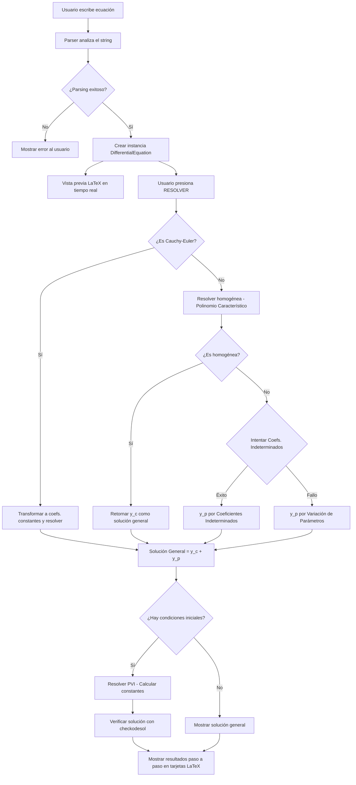

# 🚀 Antigravity — Solucionador de Ecuaciones Diferenciales Ordinarias

---

## 1. Introducción del Proyecto

**Nombre del proyecto:** Antigravity — Solucionador de EDOs

**Descripción general:**  
Antigravity es una aplicación de escritorio que desarrollé con el objetivo de resolver Ecuaciones Diferenciales Ordinarias (EDOs) de orden *n* de forma automática, mostrando los resultados paso a paso con notación matemática renderizada en LaTeX. La aplicación combina un motor de cálculo simbólico potente con una interfaz gráfica moderna, intuitiva y visualmente atractiva.

**¿Qué problema resuelve?**  
Resolver ecuaciones diferenciales manualmente es un proceso largo, propenso a errores y que exige dominio de múltiples técnicas matemáticas. Antigravity automatiza todo ese flujo: desde la interpretación de la ecuación ingresada por el usuario, hasta la selección del método de solución más adecuado, pasando por la resolución simbólica y la verificación del resultado. Todo esto se presenta en una interfaz oscura y profesional que renderiza las expresiones en formato LaTeX para que se lean como en un libro de texto.

**¿A quién va dirigido?**  
- Estudiantes de ingeniería y ciencias que cursan materias de ecuaciones diferenciales.
- Profesores que desean una herramienta de verificación rápida de soluciones.
- Cualquier profesional que necesite obtener soluciones analíticas aproximadas de EDOs lineales de forma eficiente.

---

## 2. Problema que se Buscaba Resolver

Cuando comencé a cursar la materia de **Ecuaciones Diferenciales** en el tercer semestre de la carrera de Ingeniería en Sistemas Computacionales en ESCOM, me di cuenta de que el proceso de resolver EDOs de orden elevado manualmente requiere un dominio preciso de múltiples pasos: construir el polinomio característico, factorizar raíces (reales, repetidas o complejas), proponer soluciones particulares, aplicar la regla de modificación, construir el Wronskiano, integrar simbólicamente, y finalmente verificar el resultado.

Las herramientas existentes presentaban varias limitaciones:

- **Wolfram Alpha / Mathematica:** Son potentes, pero muchas veces solo devuelven el resultado final sin desglosar el procedimiento paso a paso. Además, las versiones completas son de pago.
- **Calculadoras en línea:** Suelen ser limitadas en los tipos de EDOs que pueden manejar y rara vez soportan Cauchy-Euler o Variación de Parámetros con desglose de pasos.
- **Resolución manual:** Es la forma en que aprendemos en clase, pero es lenta y propensa a errores de cálculo, especialmente en exámenes o tareas con múltiples ejercicios.

Decidí crear Antigravity como una herramienta que no solo resuelve la ecuación, sino que **muestra cada paso intermedio** (solución homogénea, solución particular, solución general, verificación), permitiendo al estudiante entender el proceso y verificar su propio trabajo manual.

---

## 3. Objetivos del Proyecto

### Objetivo General

Desarrollar una aplicación de escritorio funcional y profesional capaz de resolver Ecuaciones Diferenciales Ordinarias lineales de orden *n*, utilizando cálculo simbólico, y presentar los resultados de forma clara, paso a paso, con notación matemática de calidad.

### Objetivos Específicos

1. **Implementar un motor de resolución** (`ode_solver.py`) que soporte múltiples métodos:
   - Ecuación característica para EDOs homogéneas con coeficientes constantes.
   - Coeficientes Indeterminados para soluciones particulares.
   - Variación de Parámetros como método general alternativo.
   - Cauchy-Euler para ecuaciones con coeficientes variables de la forma $a_n x^n y^{(n)}$.

2. **Desarrollar un parser robusto** (`utils.py`) que interprete ecuaciones escritas en texto plano (ej. `y'' + 4*y' + 4*y = exp(2*x)`) y las convierta en objetos matemáticos manipulables por SymPy.

3. **Construir una interfaz gráfica moderna** (`gui.py`) con PyQt6 que incluya:
   - Un teclado matemático virtual organizado por secciones.
   - Vista previa en tiempo real de la ecuación renderizada en LaTeX.
   - Campos dinámicos de condiciones iniciales.
   - Panel de resultados con tarjetas expandibles para cada paso de la solución.

4. **Incluir un sistema de verificación** que valide automáticamente si la solución obtenida satisface la EDO original.

5. **Resolver problemas de valor inicial (PVI)** aplicando las condiciones iniciales proporcionadas por el usuario para calcular las constantes de integración.

6. **Empaquetar la aplicación como ejecutable** (`.exe`) para distribución sin necesidad de instalar Python.

---

## 4. Tecnologías Utilizadas

| Categoría | Tecnología | Propósito |
|---|---|---|
| **Lenguaje** | Python 3.x | Lenguaje principal de desarrollo |
| **Cálculo simbólico** | SymPy | Resolución algebraica, derivadas, integrales, LaTeX |
| **Cálculo numérico** | NumPy | Soporte para operaciones matriciales (Wronskiano) |
| **Interfaz gráfica** | PyQt6 | Framework de GUI para aplicaciones de escritorio |
| **Visualización** | Matplotlib (Backend QtAgg) | Renderizado de expresiones LaTeX dentro de la GUI |
| **Empaquetado** | PyInstaller | Generación del ejecutable `.exe` distribuible |
| **IDE** | Visual Studio Code | Entorno de desarrollo |
| **Control de versiones** | Git | Versionado del código fuente |

### Justificación de las tecnologías

- **SymPy** fue la elección clave porque permite trabajar con matemáticas simbólicas de forma nativa en Python: resolver polinomios, calcular derivadas e integrales simbólicas, simplificar expresiones y exportar a LaTeX.
- **PyQt6** se eligió sobre Tkinter por su capacidad de crear interfaces modernas con estilos QSS (similar a CSS), mejor soporte de layouts complejos y la posibilidad de integrar Matplotlib como widget nativo.
- **Matplotlib con backend QtAgg** fue esencial para renderizar las expresiones matemáticas en formato LaTeX directamente dentro de la interfaz, logrando una presentación visual de calidad profesional.

---

## 5. Metodología de Desarrollo

El desarrollo de Antigravity se llevó a cabo siguiendo un **enfoque incremental** organizado en tres fases principales:

### Fase 1: Motor de Resolución (Backend)

En la primera fase me enfoqué exclusivamente en construir la lógica matemática. Implementé la clase `DifferentialEquation` con todos sus métodos de resolución, así como el módulo de parsing (`utils.py`). Esta fase se validó mediante un script de consola (`main.py` con demos comentadas) que probaba distintos tipos de ecuaciones.

### Fase 2: Interfaz Gráfica (Frontend)

Una vez que el motor de resolución funcionaba correctamente desde la consola, comencé a construir la interfaz gráfica con PyQt6. Primero creé un prototipo funcional básico, y posteriormente lo refactoricé completamente para lograr un diseño profesional con tema oscuro, mejor espaciado, y tarjetas de resultados expandibles.

### Fase 3: Integración, Pulido y Empaquetado

En la fase final conecté el frontend con el backend, implementé el manejo de errores con diálogos de usuario, ajusté el estilo visual, y empaquetité la aplicación como ejecutable usando PyInstaller para distribución sin dependencias.

### Diagrama del flujo de desarrollo:

```
Motor Matemático (ode_solver.py + utils.py)
        │
        ▼
Validación por Consola (main.py demo)
        │
        ▼
Prototipo de GUI (gui.py v1)
        │
        ▼
Rediseño Visual (gui.py v2 - Dark Theme)
        │
        ▼
Integración Backend ↔ Frontend
        │
        ▼
Empaquetado (PyInstaller → Antigravity.exe)
```

---

## 6. Diseño del Sistema

### Arquitectura General

Antigravity sigue una **arquitectura modular por capas** con separación clara entre la lógica de negocio (resolución matemática), las utilidades de soporte, y la capa de presentación (interfaz gráfica).


### Estructura de Archivos

```
Programa_EDOS/
├── Documentacion.md          ← Este documento
├── antigravity_core/
│   ├── __init__.py           ← Inicializador del paquete
│   ├── main.py               ← Punto de entrada de la aplicación
│   ├── ode_solver.py         ← Motor de resolución de EDOs (555 líneas)
│   ├── gui.py                ← Interfaz gráfica PyQt6 (519 líneas)
│   ├── utils.py              ← Parsing y formateo LaTeX (127 líneas)
│   ├── requirements.txt      ← Dependencias del proyecto
│   ├── Antigravity.spec      ← Configuración de PyInstaller
│   ├── build/                ← Archivos de compilación
│   └── dist/
│       └── Antigravity.exe   ← Ejecutable distribuible (~100 MB)
```

### Módulos del Sistema

#### 1. `main.py` — Punto de Entrada
- Inicializa la aplicación Qt (`QApplication`).
- Crea e instancia la ventana principal (`MainWindow`).
- Contiene además código comentado de una demo por consola que utilicé durante el desarrollo para probar el motor antes de tener la GUI.

#### 2. `ode_solver.py` — Motor de Resolución (Núcleo)
Contiene la clase `DifferentialEquation` con los siguientes componentes:

| Método | Descripción |
|---|---|
| `__init__()` | Inicializa atributos: orden, coeficientes, función forzada, variable simbólica |
| `from_string()` | Factory method estático que parsea un string y retorna una instancia |
| `solve_homogeneous()` | Resuelve la parte homogénea mediante el polinomio característico |
| `solve_undetermined_coefficients()` | Calcula la solución particular por Coeficientes Indeterminados |
| `solve_variation_parameters()` | Calcula la solución particular por Variación de Parámetros (Wronskiano) |
| `solve_cauchy_euler()` | Detecta y resuelve ecuaciones de tipo Cauchy-Euler |
| `solve()` | Método orquestador que selecciona automáticamente el mejor método |
| `verify_solution()` | Verifica la solución usando `sympy.checkodesol` |
| `solve_ivp()` | Aplica condiciones iniciales para hallar constantes específicas |

#### 3. `gui.py` — Interfaz Gráfica
Contiene tres clases:

- **`MatplotlibWidget`**: Widget personalizado que hereda de `FigureCanvasQTAgg` para renderizar expresiones LaTeX dentro de la GUI.
- **`MathKeyboard`**: Widget con un teclado matemático virtual organizado en tres secciones (funciones, numpad, operadores).
- **`MainWindow`**: Ventana principal con todo el flujo de la aplicación (entrada, preview, configuración, resolución, resultados).

#### 4. `utils.py` — Utilidades
- **`parse_ode_string()`**: Analiza una cadena de texto y extrae el orden, coeficientes y función forzada de la EDO usando expresiones regulares y `sympy.parse_expr`.
- **`format_latex()`**: Convierte expresiones SymPy a notación LaTeX, forzando la notación `\ln` en lugar de `\log`.

### Diagrama de Flujo del Programa



---

## 7. Implementación

### 7.1 Parser de Ecuaciones (`utils.py`)

Uno de los retos más interesantes fue construir un parser capaz de interpretar ecuaciones escritas en texto plano de forma natural. El usuario puede escribir algo como:

```
y'' + 4*y' + 4*y = exp(2*x)
```

Y el parser debe:
1. **Normalizar** la cadena (eliminar espacios, convertir `^` a `**`).
2. **Separar** el lado izquierdo y derecho por el signo `=`.
3. **Reemplazar derivadas** usando regex: `y'''` se convierte en `Derivative(y, x, 3)`.
4. **Parsear** la expresión con `sympy.parse_expr`, inyectando un diccionario local con las funciones matemáticas (`exp`, `sin`, `cos`, `tan`, `ln`).
5. **Clasificar** cada término como parte de los coeficientes de `y` y sus derivadas, o como parte de la función forzada.

```python
# Ejemplo del reemplazo de derivadas con regex
s = re.sub(r"y('+)", lambda m: f"Derivative(y, x, {len(m.group(1))})", s)
```

Un detalle técnico importante fue el manejo de `y` como `Symbol` inicialmente (no como `Function`), para evitar errores de tipo `UndefinedFunction` cuando `y` aparece sola sin derivadas. Después del parsing, se sustituye el `Symbol('y')` por `Function('y')(x)`.

### 7.2 Solución Homogénea (`solve_homogeneous`)

El corazón del módulo homogéneo es la construcción y resolución del **polinomio característico**:

$$P(m) = a_n m^n + a_{n-1} m^{n-1} + \cdots + a_1 m + a_0$$

Utilicé `sympy.roots()` en lugar de `sympy.solve()` porque `roots()` devuelve un diccionario `{raíz: multiplicidad}`, lo cual es fundamental para manejar correctamente tres casos:

| Caso | Contribución a $y_c$ |
|---|---|
| **Raíz real distinta** $m = r$ | $C_i e^{rx}$ |
| **Raíz real repetida** $m = r$ (mult. $k$) | $C_i x^j e^{rx}$ para $j = 0, 1, ..., k-1$ |
| **Raíces complejas conjugadas** $m = \alpha \pm \beta i$ | $e^{\alpha x}(C_i \cos \beta x + C_{i+1} \sin \beta x)$ |

Un aspecto clave de mi implementación es el manejo de **pares conjugados**: cuando se encuentra una raíz compleja, se marca su conjugada como "procesada" para evitar duplicación.

```python
processed_roots = set()
for r, multiplicity in roots_dict.items():
    if r in processed_roots:
        continue
    if sympy.im(r) == 0:
        # Raíz real...
    else:
        conjugate = sympy.conjugate(r)
        processed_roots.add(conjugate)
        alpha = sympy.re(r)
        beta = sympy.im(r)
        # Generar términos cos/sin...
```

### 7.3 Coeficientes Indeterminados (`solve_undetermined_coefficients`)

Este método implementa la técnica clásica para encontrar una solución particular $y_p$ cuando $g(x)$ tiene una forma específica (polinomios, exponenciales, seno/coseno o combinaciones).

El algoritmo:
1. **Descompone** $g(x)$ en términos sumandos.
2. Para cada término, **analiza** su forma: extrae la parte exponencial ($e^{\alpha x}$), trigonométrica ($\sin \beta x$, $\cos \beta x$) y polinomial ($x^k$).
3. **Detecta resonancia**: compara $\alpha + i\beta$ con las raíces del polinomio característico. Si hay coincidencia con multiplicidad $s$, multiplica la propuesta por $x^s$ (regla de modificación).
4. **Construye la forma propuesta** con coeficientes simbólicos desconocidos ($A_0, A_1, ..., B_0, B_1, ...$).
5. **Sustituye** en la EDO y resuelve el sistema de ecuaciones lineales resultante para hallar los valores de los coeficientes.

Una decisión técnica importante fue usar **nombres únicos generados aleatoriamente** para los coeficientes indeterminados (`A_0_3847`, `B_1_9201`) para evitar colisiones entre diferentes términos de $g(x)$:

```python
A = sympy.symbols(f'A_{len(unknowns)}_{random.randint(0, 10000)}')
```

### 7.4 Variación de Parámetros (`solve_variation_parameters`)

Este es el método más general y se usa como **fallback** cuando Coeficientes Indeterminados no es aplicable (por ejemplo, para $g(x) = \tan(x)$ o $g(x) = \sec(x)$).

El procedimiento implementado:
1. **Obtener el conjunto fundamental** de soluciones $\{y_1, y_2, ..., y_n\}$ de la homogénea.
2. **Construir la Matriz Wronskiana** $W$:

$$W = \begin{pmatrix} y_1 & y_2 & \cdots & y_n \\ y_1' & y_2' & \cdots & y_n' \\ \vdots & \vdots & \ddots & \vdots \\ y_1^{(n-1)} & y_2^{(n-1)} & \cdots & y_n^{(n-1)} \end{pmatrix}$$

3. **Calcular el determinante** $W = \det(W)$.
4. **Aplicar la regla de Cramer**: para cada $k$, construir la matriz $W_k$ reemplazando la columna $k$ por el vector $[0, 0, ..., g(x)/a_n]^T$.
5. **Integrar** $u_k' = \det(W_k) / W$ para obtener los parámetros $u_k$.
6. La solución particular es $y_p = \sum u_k \cdot y_k$.

```python
# Construcción de la Matriz Wronskiana
W_matrix = sympy.Matrix.zeros(self.order, self.order)
for j in range(self.order):
    func = basis[j]
    for i in range(self.order):
        W_matrix[i, j] = sympy.diff(func, x, i)
```

### 7.5 Cauchy-Euler (`solve_cauchy_euler`)

Para ecuaciones de la forma:

$$a_n x^n y^{(n)} + a_{n-1} x^{n-1} y^{(n-1)} + \cdots + a_0 y = g(x)$$

El método realiza una **detección automática** verificando que cada coeficiente es proporcional a $x^k$ para el orden de derivada correspondiente. Si se confirma, aplica la **sustitución $x = e^t$** que transforma la ecuación de Cauchy-Euler en una EDO con coeficientes constantes:

$$x^k D^k \rightarrow D_t(D_t - 1)(D_t - 2) \cdots (D_t - k + 1)$$

Implementé esto construyendo el polinomio operador con **factoriales descendentes** y luego creando una nueva instancia de `DifferentialEquation` con los coeficientes constantes resultantes, resolviendo recursivamente, y finalmente sustituyendo $t = \ln(x)$ en la solución.

### 7.6 Interfaz Gráfica (`gui.py`)

La GUI fue diseñada siguiendo principios de **UX moderno** con un tema oscuro profesional. Algunos detalles técnicos relevantes:

- **Tema QSS completo**: Implementé una hoja de estilo completa similar a CSS que define colores, bordes redondeados, hover effects y una paleta de colores coherente.
- **Teclado matemático modular**: La clase `MathKeyboard` usa señales Qt (`pyqtSignal`) para comunicar las pulsaciones al campo de entrada, manteniendo el acoplamiento bajo.
- **Vista previa en tiempo real**: Cada vez que el texto del campo de entrada cambia, se dispara `update_preview()` que intenta parsear la ecuación y renderizarla en LaTeX dentro de un widget Matplotlib.
- **Campos de condiciones iniciales dinámicos**: Al detectar el orden de la EDO, la interfaz genera automáticamente los campos $y(0), y'(0), y''(0), ...$ necesarios.
- **Tarjetas de resultados**: Cada paso se muestra en un `QFrame` estilizado como tarjeta con título en verde y contenido LaTeX renderizado por Matplotlib.

---

## 8. Resultados

La aplicación logra resolver satisfactoriamente una amplia variedad de EDOs lineales. A continuación presento la interfaz y ejemplos de uso:

### Interfaz Principal


La interfaz muestra los componentes principales: campo de entrada con teclado matemático virtual, vista previa en LaTeX, selector de método y botón de resolución.

### Panel de Resultados


Los resultados se presentan en tarjetas cronológicas mostrando cada paso: ecuación original, solución homogénea, solución particular, solución general, y verificación.

### Ejemplos de Ecuaciones que la Aplicación Resuelve

| Tipo de Ecuación | Ejemplo | Método Aplicado |
|---|---|---|
| Homogénea - Raíces reales distintas | `y'' - 3*y' + 2*y = 0` | Polinomio Característico |
| Homogénea - Raíces repetidas | `y'' - 4*y' + 4*y = 0` | Polinomio Característico |
| Homogénea - Raíces complejas | `y'' + 4*y = 0` | Polinomio Característico |
| No homogénea - Polinomio | `y'' - 3*y' + 2*y = 2*x^2 - 6*x + 4` | Coeficientes Indeterminados |
| No homogénea - Exponencial con resonancia | `y'' - 3*y' + 2*y = exp(x)` | Coeficientes Indeterminados |
| No homogénea - Tangente | `y'' + y = tan(x)` | Variación de Parámetros |
| Cauchy-Euler homogénea | `x^2*y'' - 2*x*y' + 2*y = 0` | Cauchy-Euler |
| Cauchy-Euler no homogénea | `x^2*y'' - 2*x*y' + 2*y = x^3` | Cauchy-Euler |

### Características de la Salida

- **Ecuación Original** renderizada en notación matemática limpia.
- **Solución Homogénea** ($y_c$) con constantes $C_1, C_2, ...$
- **Solución Particular** ($y_p$) cuando aplica.
- **Solución General** ($y = y_c + y_p$).
- **Método utilizado** indicado explícitamente.
- **Solución PVI** con constantes evaluadas cuando se proporcionan condiciones iniciales.
- **Verificación automática** (✅ Verificado Correcto / ⚠️ Verificación Fallida) usando `sympy.checkodesol`.

---

## 9. Retos Encontrados

### 🔧 Reto 1: Parsing robusto de ecuaciones
El mayor desafío técnico fue construir un parser que aceptara notación humana natural. El problema principal surgió cuando `y` aparecía sola (sin derivadas): SymPy la trataba como `UndefinedFunction`, causando errores de tipo `unsupported operand type(s) for *: 'integer' and 'UndefinedFunction'`. La solución fue tratar `y` como un `Symbol` durante el parsing y luego sustituirla por `Function('y')(x)` después de la expansión.

### 🔧 Reto 2: Resonancia en Coeficientes Indeterminados
Implementar correctamente la **regla de modificación** (multiplicar por $x^s$ cuando la forma propuesta de $y_p$ ya existe en $y_c$) requirió un análisis cuidadoso de qué constituye una "duplicación". Tuve que comparar la raíz crítica $\alpha + i\beta$ de cada término de $g(x)$ contra las raíces del polinomio característico y usar la multiplicidad como exponente $s$.

### 🔧 Reto 3: Pares de raíces complejas conjugadas
Cuando SymPy devuelve raíces complejas, devuelve ambas partes del par conjugado ($\alpha + \beta i$ y $\alpha - \beta i$). Generar la solución real (con $\cos$ y $\sin$) requirió implementar un mecanismo de "marcado" para evitar procesar el mismo par dos veces.

### 🔧 Reto 4: Integración simbólica en Variación de Parámetros
No todas las funciones $u_k' = W_k / W$ tienen antiderivadas en forma cerrada. SymPy a veces retorna objetos `Integral` no evaluados. Implementé manejo de errores con `try-except` para estos casos.

### 🔧 Reto 5: Renderizado LaTeX en PyQt6
Incrustar Matplotlib dentro de PyQt6 como motor de renderizado LaTeX requirió usar el backend `FigureCanvasQTAgg` y configurar correctamente las figuras para que se vieran bien en tema oscuro (fondo transparente, texto blanco, tamaños mínimos adecuados).

### 🔧 Reto 6: Diseño de UI responsivo
El primer prototipo de la GUI tenía problemas graves de espaciado: los resultados se veían aplastados y los gráficos LaTeX eran ilegibles. Fue necesario un rediseño completo implementando un `QScrollArea` global, tarjetas con `minimumHeight` generoso (180px), y una hoja de estilos QSS profesional.

---

## 10. Mejoras Futuras

| Mejora | Descripción |
|---|---|
| **Más métodos numéricos** | Implementar métodos numéricos como Runge-Kutta, Euler y Adams-Bashforth para EDOs que no tienen solución analítica cerrada |
| **Gráficas de solución** | Agregar un módulo de visualización que grafique la función solución $y(x)$ además de la expresión simbólica |
| **Exportación de resultados** | Permitir exportar los pasos de la solución como PDF, imagen, o archivo LaTeX |
| **Soporte para sistemas de EDOs** | Extender el motor para resolver sistemas de ecuaciones diferenciales lineales usando matrices |
| **Versión web** | Crear una versión web usando Flask/Django + MathJax para hacer la herramienta accesible desde el navegador |
| **EDOs no lineales** | Investigar e implementar métodos para ecuaciones diferenciales no lineales |
| **Historial de ecuaciones** | Guardar un registro de las ecuaciones resueltas previamente para consulta rápida |
| **Soporte multidioma** | Agregar interfaz en inglés además de español |
| **Campo de dirección** | Implementar visualización del campo de direcciones para EDOs de primer orden |
| **Temas de interfaz** | Ofrecer opciones de tema claro además del oscuro |

---

## 11. Conclusión

El desarrollo de **Antigravity** fue una experiencia que me permitió fusionar dos áreas que me apasionan: la programación y las matemáticas. Construir esta herramienta me obligó a comprender profundamente cada método de resolución de EDOs —no como fórmulas que se memorizan, sino como algoritmos que pueden ser implementados y automatizados.

A nivel técnico, fortalecí mis habilidades en:
- **Cálculo simbólico computacional** con SymPy (parsing, resolución de ecuaciones, manipulación algebraica).
- **Diseño de software modular** con separación clara entre lógica de negocio y presentación.
- **Desarrollo de interfaces gráficas** profesionales con PyQt6 y estilizado con QSS.
- **Integración de componentes heterogéneos** (SymPy + Matplotlib + PyQt6 trabajando en armonía).
- **Empaquetado y distribución** de aplicaciones Python como ejecutables independientes.

A nivel personal, este proyecto reforzó mi convicción de que la mejor forma de aprender un concepto es construir algo con él. Antigravity no es solo un programa que resuelve ecuaciones diferenciales: es la evidencia de que entendí lo suficiente como para enseñarle a una computadora a hacerlo.

---

## 📋 Ficha Técnica del Proyecto

| Campo | Detalle |
|---|---|
| **Nombre** | Antigravity — Solucionador de EDOs |
| **Autor** | Noe Rodriguez |
| **Institución** | ESCOM - IPN |
| **Materia** | Ecuaciones Diferenciales (3er Semestre) |
| **Duración del desarrollo** | Proyecto del semestre |
| **Rol** | Desarrollo individual |
| **Líneas de código** | ~1,200+ líneas (Python) |
| **Ejecutable** | `Antigravity.exe` (~100 MB) |
| **Estado** | Funcional y ejecutable |
